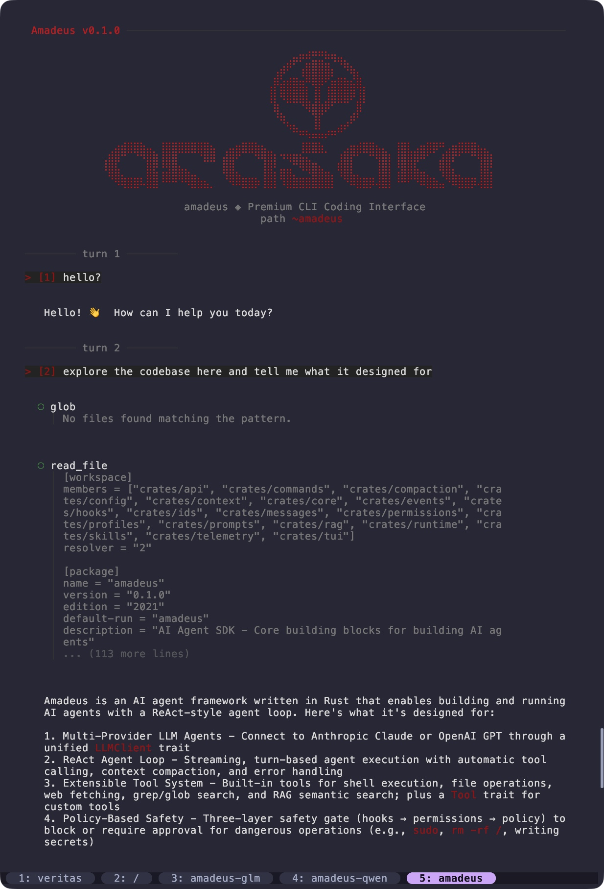

# Amadeus

An AI agent framework in Rust with a ReAct-style agent loop, multi-provider LLM support, an extensible tool system, policy-based safety controls, and both interactive TUI and REST API adapters over a shared core runtime.



## Features

- **Multi-Provider LLM** — Works with Anthropic Claude and OpenAI GPT behind a generic `LLMClient` trait; zero-cost polymorphism via monomorphization.
- **ReAct Agent Loop** — Streaming turn-based loop with tool execution, context compaction, and retryable error handling.
- **Extensible Tool System** — Built-in tools for shell, filesystem, search, and web; register custom tools via the `Tool` trait; MCP server integration.
- **Policy-Based Safety** — Three-layer execution gate: hooks (input mutation/blocking), permissionenforcer (hard blocks by mode), and policy (Auto / Ask / Strict approval).
- **Multi-Agent Orchestration** — Spawn agents with distinct profiles, route tasks by capability, and coordinate with a priority-ordered task queue.
- **RAG Semantic Search** — Ingest files, URLs, or raw text into a persistent vector store; agents can query at runtime through the `rag` tool.
- **Context Compaction** — Automatic context-window management with configurable thresholds, LLM-based summarization, and pluggable triggers.
- **Interactive TUI** — ratatui-based inline terminal UI with multi-panel layout, approval dialogs, tool monitoring, themed rendering, and conversation export.
- **HTTP API** — Axum REST + SSE server with 30+ endpoints for chat, sessions, multi-agent orchestration, memory, compaction, RAG, and more.
- **Telemetry** — Structured event recording with pluggable sinks (JSONL file, in-memory) for runtime observability.
- **Session Management** — Automatic session persistence, restore, checkpoints with code-state rewind, and conversation export to Markdown or JSON.

## Quickstart

### Prerequisites

- Rust 1.70 or later
- API key from Anthropic or OpenAI

### Setup

```bash
git clone https://github.com/xxraincandyxx/Amadeus.git
cd Amadeus

# Copy settings template and configure your provider
mkdir -p .amadeus
cp .amadeus/settings.example.json .amadeus/settings.json
# Edit .amadeus/settings.json with your API key and provider

cargo build --release --features full
```

### Interactive Terminal UI

```bash
cargo run --features full
```

### HTTP API Server

```bash
# Default port 3000
cargo run --features full -- --server

# Custom port
cargo run --features full -- --server 8080
```

## Using as a Library

Add to your `Cargo.toml`:

```toml
[dependencies]
amadeus = { git = "https://github.com/xxraincandyxx/Amadeus", features = ["full"] }
tokio = { version = "1", features = ["full"] }
```

### Creating an Agent

```rust
use amadeus::{Agent, Config, AnthropicClient};
use std::sync::Arc;

#[tokio::main]
async fn main() -> Result<(), Box<dyn std::error::Error>> {
    let config = Arc::new(Config::load()?);

    let client = AnthropicClient::new(
        config.api_key.clone(),
        config.base_url.clone(),
        config.model.clone(),
    );

    let agent = Agent::builder(client, config)
        .with_default_tools()
        .build();

    let result = agent.run("Create a hello world program in Rust").await?;
    println!("{}", result.text);

    Ok(())
}
```

### Custom Tools

```rust
use amadeus::{Agent, Config, OpenAIClient, Tool};
use amadeus::error::AgentError;
use async_trait::async_trait;
use serde_json::Value;
use std::sync::Arc;

struct WeatherTool;

#[async_trait]
impl Tool for WeatherTool {
    fn name(&self) -> &'static str {
        "get_weather"
    }

    fn schema(&self) -> &'static Value {
        &serde_json::json!({
            "name": "get_weather",
            "description": "Get the current weather for a location",
            "input_schema": {
                "type": "object",
                "properties": {
                    "location": { "type": "string" }
                },
                "required": ["location"]
            }
        })
    }

    async fn execute(&self, input: Value) -> Result<String, AgentError> {
        let location = input["location"].as_str().unwrap_or("unknown");
        Ok(format!("Sunny, 72F in {location}"))
    }
}

#[tokio::main]
async fn main() -> Result<(), Box<dyn std::error::Error>> {
    let config = Arc::new(Config::load()?);
    let client = OpenAIClient::new(
        config.api_key.clone(),
        config.base_url.clone(),
        config.model.clone(),
    );

    let agent = Agent::builder(client, config)
        .with_default_tools()
        .register_tool(Box::new(WeatherTool))
        .build();

    let result = agent.run("What's the weather in Tokyo?").await?;
    println!("{}", result.text);

    Ok(())
}
```

### Event Streaming

```rust
use amadeus::events::AgentEvent;

let mut stream = agent.run_stream();

while let Some(event) = stream.next().await {
    match event? {
        AgentEvent::TextDelta { delta } => print!("{}", delta),
        AgentEvent::ToolStart { id, name } => {
            println!("\n[Tool: {}]", name);
        }
        AgentEvent::ToolComplete { name, output, .. } => {
            println!("Output: {}", output);
        }
        AgentEvent::TokenUsage { total_tokens, .. } => {
            println!("\nTokens: {}", total_tokens);
        }
        AgentEvent::Done { result } => {
            println!("\nComplete!");
        }
        _ => {}
    }
}
```

### Policy & Safety

```rust
use amadeus::policy::{Policy, ApprovalMode};
use std::sync::Arc;

// Auto: all tools execute without approval
let mut policy = Policy::new();
policy.set_mode(ApprovalMode::Auto);

// Ask (default): only dangerous operations require approval
let mut policy = Policy::new();
policy.set_mode(ApprovalMode::Ask);

// Strict: all tools require approval except auto-approved ones
let mut policy = Policy::new();
policy.set_mode(ApprovalMode::Strict);

let agent = Agent::builder(client, config)
    .with_default_tools()
    .with_policy(Arc::new(policy))
    .build();
```

The policy system blocks dangerous patterns including `sudo`, `chmod 777`, `rm -rf /`, writing to `.env`/`.pem`/`.key` files, and shell pipes to `bash`/`sh`.

## Architecture

Amadeus is a Cargo workspace built around a shared core runtime with pluggable frontends.

```
CLI / Library call
  -> Config + Provider selection
  -> Core Runtime
  -> TUI adapter | HTTP adapter | Assessment runner
```

### Workspace Layout

| Crate | Role |
|-------|------|
| `amadeus` (root) | Compatibility facade and CLI entry point |
| `crates/core` | Agent loop, LLM clients, tools, policy, hooks, orchestration |
| `crates/tui` | ratatui terminal UI adapter |
| `crates/api` | Axum HTTP + SSE server |
| `crates/config` | Layered settings loading |
| `crates/events` | Shared event model (`AgentEvent`, `RunResult`, etc.) |
| `crates/runtime` | Orchestration models, worker selection, task dispatch |
| `crates/compaction` | Context window compaction triggers and results |
| `crates/context` | Project context loading, memory providers |
| `crates/rag` | Semantic search, embedding, vector store |
| `crates/telemetry` | Structured event recording with pluggable sinks |
| `crates/permissions` | Permission modes and enforcement |
| `crates/hooks` | Pre/post-tool hook descriptors |
| `crates/profiles` | Agent profile definitions |
| `crates/prompts` | System prompt templating |
| `crates/messages` | Message and content block types |
| `crates/commands` | Slash commands and citation handling |
| `crates/skills` | Prompt template skill loading |
| `crates/ids` | Identity types (`AgentId`, `TeamId`) |

### Core Execution Flow

The agent loop follows a ReAct-style pattern:

1. **Compaction Check** — If context window exceeds the configurable threshold (default 75%), summarize older messages to reclaim tokens.
2. **LLM Call** — Stream LLM response with system prompt, conversation history, and tool schemas.
3. **Event Processing** — Parse text deltas, reasoning output, and incremental tool call JSON.
4. **Tool Execution Gate** — For each completed tool call: hooks (can modify input or block) → permission enforcer (hard blocks by mode) → policy (Auto/Ask/Strict approval) → execute.
5. **History Update** — Push assistant and tool result messages back into history.
6. **Loop or Complete** — If tools were used, continue to the next turn; otherwise emit the final response.

Sub-agents are spawned as full child `Agent` instances with namespaced event IDs, bounded recursion depth, and optional UI delegation.

### Three-Layer Safety Gate

| Layer | Purpose |
|-------|---------|
| **Hooks** | Extensible pre/post-tool interceptors that can modify input or block execution |
| **Permissions** | Mode-based hard blocks: `ReadOnly`, `WorkspaceWrite`, `DangerFullAccess`, `Prompt` |
| **Policy** | Runtime approval: `Auto` (none), `Ask` (dangerous only), `Strict` (all) |

## Built-in Tools

| Tool | Description | Permission |
|------|-------------|------------|
| `bash` | Execute shell commands | Requires approval for dangerous commands |
| `read_file` | Read file contents | Auto-approved |
| `write_file` | Write or create files | Requires approval for sensitive paths |
| `edit_file` | Surgical file edits with diff rendering | Requires approval |
| `glob` | Pattern-based file matching | Auto-approved |
| `grep` | Search file contents with regex | Auto-approved |
| `web_fetch` | Fetch and render web page content | Requires approval |
| `todo` | Task tracking and planning | Auto-approved |
| `rag` | Ingest, search, and manage a vector-knowledge base | Runtime |
| `memory` | Store and retrieve session-scoped notes | Runtime |

## Feature Flags

```toml
[dependencies]
amadeus = { git = "https://github.com/xxraincandyxx/Amadeus", features = ["full"] }
```

| Feature | Description |
|---------|-------------|
| `api` | HTTP adapter and REST/SSE server (implies `orchestra`) |
| `tui` | Terminal UI adapter (implies `concurrency`) |
| `concurrency` | Locking and shared coordination primitives |
| `orchestra` | Multi-agent orchestration surface (implies `concurrency`) |
| `context` | Context management and memory providers |
| `test-utils` | Test helpers and recording support |
| `full` | All of the above |

## Configuration

Structured settings in `.amadeus/settings.json`, with global defaults in `~/.amadeus/settings.json` and workspace overrides in `.amadeus/settings.local.json`:

```json
{
  "provider": "anthropic",
  "api_key": "sk-ant-xxx",
  "base_url": "https://api.anthropic.com",
  "model": "claude-sonnet-4-5-20250929",
  "timeout_seconds": 120,
  "max_output_bytes": 50000,
  "session_log_dir": "./logs",
  "session_log_compress": true,
  "blocked_commands": ["rm -rf /", "sudo"]
}
```

### TUI: Live Viewport

The **live viewport** is the reserved region above the composer that shows in-progress streaming text, tool-monitor previews, and compaction previews (plus an idle dashboard when empty). It defaults to **hidden** so the terminal stays focused on the committed transcript.

```json
{
  "tui": {
    "live_viewport": {
      "mode": "hidden",
      "height_percent": 32
    }
  }
}
```

| `mode`     | Behavior                                                                                  |
|------------|-------------------------------------------------------------------------------------------|
| `hidden`   | Never render the viewport. **Default.**                                                   |
| `auto`     | Render only during live activity (streaming / tool runs / pending compaction) or when empty. |
| `always`   | Always reserve space, including the idle dashboard.                                       |

- `height_percent` (5–95, default 32) controls how much terminal height the viewport claims when visible.
- Override at launch without editing settings via `AMADEUS_LIVE_VIEWPORT=hidden|auto|always`.
- Toggle at runtime with `/viewport` (no arg reports current mode): `/viewport auto`, `/viewport hidden`, `/viewport always`.

## HTTP API

The HTTP API server exposes 30+ REST endpoints and SSE streaming. Start with `--server [port]` (default 3000).

### Core Endpoints

| Method | Path | Description |
|--------|------|-------------|
| `GET` | `/health` | Health check |
| `POST` | `/chat` | Stateless single-turn chat |
| `POST` | `/execute` | Direct bash command execution |
| `GET` | `/stream` | SSE streaming chat with event protocol |
| `POST` | `/tasks` | Multi-agent task dispatch |

### Agent Management

| Method | Path | Description |
|--------|------|-------------|
| `GET` | `/agents` | List agents |
| `POST` | `/agents` | Create agent with profile |
| `POST` | `/agents/:id/chat` | Chat with specific agent |
| `GET` | `/agents/:id/stream` | SSE stream from agent |

### Sessions

| Method | Path | Description |
|--------|------|-------------|
| `GET` | `/sessions` | List saved sessions |
| `GET` | `/sessions/:id` | Session detail with history |
| `POST` | `/sessions/:id/restore` | Restore session history |

### RAG

| Method | Path | Description |
|--------|------|-------------|
| `POST` | `/rag/ingest` | Ingest file, URL, or text into vector store |
| `POST` | `/rag/query` | Semantic search with natural language |
| `GET` | `/rag/documents` | List ingested documents |

### Configuration & Info

| Method | Path | Description |
|--------|------|-------------|
| `GET` | `/config` | Current configuration |
| `PATCH` | `/config` | Update runtime settings |
| `GET` | `/tools/catalog` | Available tools with schemas |
| `GET` | `/skills` | Available prompt template skills |

The API has no built-in authentication and full CORS enabled, designed for trusted internal use or deployment behind a reverse proxy.

## TUI

The terminal UI is an inline-mode application that sits at the bottom of your terminal with scrollable conversation history above.

**Layout:**
- **Messages pane** — Markdown-rendered conversation history with collapsible tool execution groups and reasoning blocks
- **Input editor** — Multi-line input with slash-command completion, `@` file citation, and `!` shell mode
- **Footer** — Model name, context usage bar, session duration, Git branch, working directory, sandbox status
- **Sidebars** — File explorer, keyboard shortcut reference, and skill browser

**Key bindings:**

| Key | Action |
|-----|--------|
| `Enter` | Submit prompt |
| `Ctrl+T` | Cycle themes (12 built-in) |
| `Shift+B` | Toggle file explorer |
| `Alt+S` | Toggle skill browser |
| `Ctrl+]` / `Ctrl+[` | Navigate sub-agent sessions |
| `Tab` / `Shift+Tab` | Cycle agent sessions |

**Slash commands:** `/compact`, `/context`, `/hooks`, `/rewind`

Conversation export to Markdown or JSON includes full session metadata, config snapshot, context report, and statistics.

## Contributing

Contributions are welcome. Please:

1. Fork the repository
2. Create a feature branch
3. Make your changes
4. Run `cargo test --features full` and `cargo clippy --all-features -- -D warnings`
5. Submit a pull request

## License

MIT — see [LICENSE](LICENSE).
