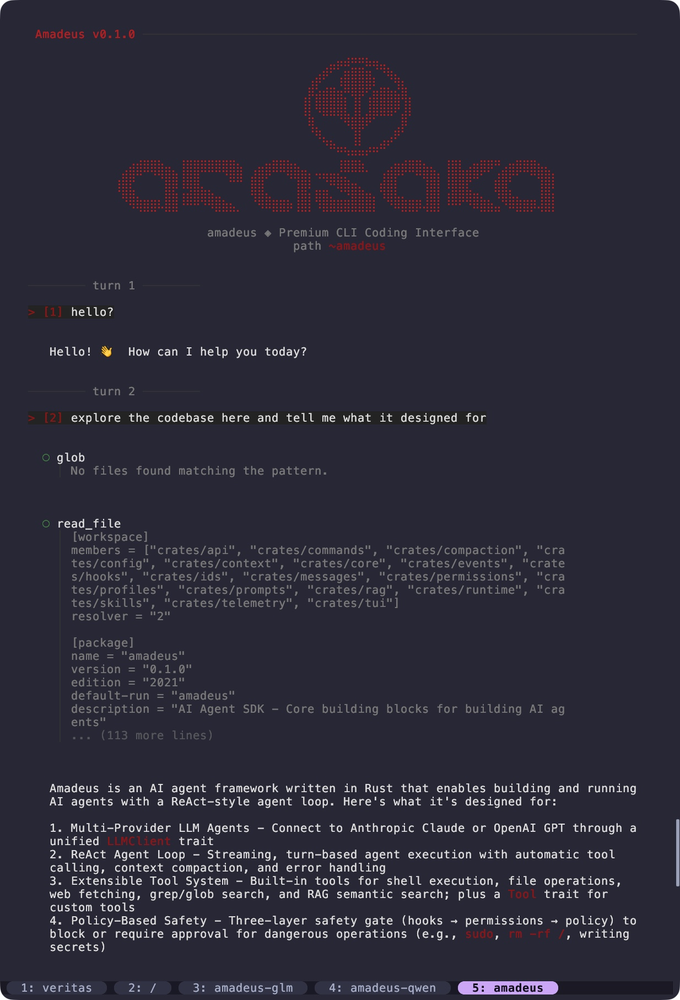
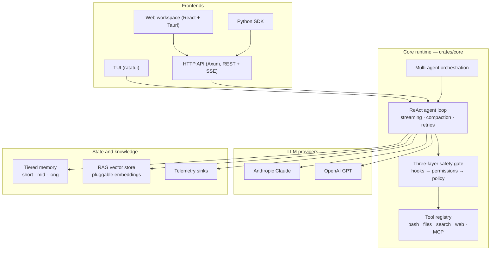

<div align="center">

# Amadeus

**A composable, multi-provider AI agent framework in Rust.**

Typed workflow runtime · ReAct agent loop · policy-based safety · tiered memory · RAG · TUI / REST / Web frontends

[](https://github.com/xxraincandyxx/Amadeus/actions/workflows/ci.yml)
[](LICENSE)
[](https://www.rust-lang.org)
[](#)
[](CONTRIBUTING.md)

[Quickstart](#quickstart) · [Architecture](#architecture) · [Memory](#tiered-memory) · [Library](#using-as-a-library) · [TUI](#tui) · [HTTP API](#http-api) · [Web & macOS](#web-workspace--macos-app) · [Python SDK](#python-sdk) · [Docs](#documentation)

</div>

---

## Highlights

- **Composable agent architectures** — Build typed asynchronous workflows, bind each workflow to an agent identity and resource set, and hold multiple differently configured agents in one registry. Models and tools are injected resources, not owners of the control flow.
- **Multi-provider LLM support** — Works with Anthropic Claude and OpenAI GPT behind a generic `LLMClient` trait; zero-cost polymorphism via monomorphization.
- **ReAct agent loop** — Streaming turn-based loop with tool execution, context compaction, and retryable error handling.
- **Extensible tool system** — Built-in tools for shell, filesystem, search, and web; register custom tools via the `Tool` trait; MCP server integration.
- **Policy-based safety** — A three-layer execution gate: hooks (input mutation/blocking), permission enforcer (hard blocks by mode), and policy (Auto / Ask / Strict approval).
- **Multi-agent orchestration** — Spawn agents with distinct profiles, route tasks by capability, and coordinate with a priority-ordered task queue.
- **Tiered memory** — Short-term context, a privacy-aware mid-term record database filled at compaction time, and long-term JSON/RAG memory (see [Tiered memory](#tiered-memory)).
- **RAG semantic search** — Ingest files, URLs, or raw text into a persistent vector store with pluggable embedding backends and int8 quantization; agents query it at runtime through the `rag` tool.
- **Context compaction** — Automatic context-window management with configurable thresholds, LLM-based summarization, and pluggable triggers.
- **Interactive TUI** — ratatui-based inline terminal UI with multi-panel layout, approval dialogs, tool monitoring, 12 themes, and conversation export.
- **HTTP API** — Axum REST + SSE server with 30+ endpoints for chat, sessions, multi-agent orchestration, memory, compaction, RAG, and more.
- **Web and macOS app** — React agent workspace with live sessions, tools, approvals, and runtime connection settings, packaged as a native Tauri macOS bundle.
- **Telemetry** — Structured event recording with pluggable sinks (JSONL file, in-memory) for runtime observability.
- **Session management** — Automatic session persistence, restore, checkpoints with code-state rewind, and conversation export to Markdown or JSON.

## Preview



## Quickstart

### Prerequisites

- Rust 1.70 or later
- An API key from Anthropic or OpenAI

### Setup

```bash
git clone https://github.com/xxraincandyxx/Amadeus.git
cd Amadeus

# Copy the settings template and configure your provider
mkdir -p .amadeus
cp .amadeus/settings.example.json .amadeus/settings.json
# Edit .amadeus/settings.json with your API key and provider

cargo build --release --features full
```

> [!TIP]
> Amadeus has no default features — use `--features full` for repository development and everyday use.

### Interactive terminal UI

```bash
cargo run --features full
```

### HTTP API server

```bash
# Default port 3000
cargo run --features full -- --server

# Custom port
cargo run --features full -- --server 8080
```

### Clean generated output

```bash
make clean
```

This removes Rust, web, and desktop builds along with generated logs, benchmark results, test output, and local caches. Dependency installations and user configuration are preserved.

## Architecture

Amadeus is a Cargo workspace built around a shared core runtime with pluggable frontends over it:


```mermaid
flowchart TB
    subgraph frontends [Frontends]
        direction LR
        TUI["TUI (ratatui)"]
        API["HTTP API (Axum, REST + SSE)"]
        WEB["Web workspace (React + Tauri)"]
        SDK["Python SDK"]
    end

    subgraph core [Core runtime — crates/core]
        LOOP["ReAct agent loop<br/>streaming · compaction · retries"]
        GATE["Three-layer safety gate<br/>hooks → permissions → policy"]
        TOOLS["Tool registry<br/>bash · files · search · web · MCP"]
        ORCH["Multi-agent orchestration"]
    end

    subgraph providers [LLM providers]
        CLAUDE["Anthropic Claude"]
        GPT["OpenAI GPT"]
    end

    subgraph state [State and knowledge]
        MEM["Tiered memory<br/>short · mid · long"]
        RAG["RAG vector store<br/>pluggable embeddings"]
        TEL["Telemetry sinks"]
    end

    TUI --> LOOP
    API --> LOOP
    WEB --> API
    SDK --> API
    ORCH --> LOOP
    LOOP --> CLAUDE
    LOOP --> GPT
    LOOP --> GATE --> TOOLS
    LOOP --> MEM
    LOOP --> RAG
    LOOP --> TEL
```

### Workspace layout

The root `amadeus` crate is a compatibility facade and the CLI entry point; implementation lives in `crates/`.

| Crate | Role |
|-------|------|
| `crates/core` | Agent loop, LLM clients, tools, policy, hooks, orchestration |
| `crates/runtime` | Orchestration models, worker selection, task dispatch |
| `crates/api` | Axum HTTP + SSE server |
| `crates/tui` | ratatui terminal UI adapter |
| `crates/config` | Layered settings loading |
| `crates/events` | Shared event model (`AgentEvent`, `RunResult`, …) |
| `crates/messages` | Message and content block types |
| `crates/compaction` | Context-window compaction triggers and results |
| `crates/context` | Project context loading, memory providers |
| `crates/memory` | Mid-term memory database and context gate |
| `crates/memory-domain` | Versioned domain memory models |
| `crates/memory-service` | Structured, privacy-aware memory service |
| `crates/privacy` | Sensitive-data detection and redaction |
| `crates/rag` | Semantic search, embedding backends, vector store |
| `crates/telemetry` | Structured event recording with pluggable sinks |
| `crates/permissions` | Permission modes and enforcement |
| `crates/hooks` | Pre/post-tool hook descriptors |
| `crates/profiles` | Agent profile definitions |
| `crates/prompts` | System prompt templating |
| `crates/commands` | Slash commands and citation handling |
| `crates/skills` | Prompt template skill loading |
| `crates/ids` | Identity types (`AgentId`, `TeamId`) |

### Core execution flow

The agent loop follows a ReAct-style pattern:

1. **Compaction check** — If the context window exceeds the configurable threshold (default 75%), summarize older messages to reclaim tokens.
2. **LLM call** — Stream the LLM response with system prompt, conversation history, and tool schemas.
3. **Event processing** — Parse text deltas, reasoning output, and incremental tool-call JSON.
4. **Tool execution gate** — For each completed tool call: hooks (can modify input or block) → permission enforcer (hard blocks by mode) → policy (Auto/Ask/Strict approval) → execute.
5. **History update** — Push assistant and tool-result messages back into history.
6. **Loop or complete** — If tools were used, continue to the next turn; otherwise emit the final response.

Sub-agents are spawned as full child `Agent` instances with namespaced event IDs, bounded recursion depth, and optional UI delegation.

### Three-layer safety gate

| Layer | Purpose |
|-------|---------|
| **Hooks** | Extensible pre/post-tool interceptors that can modify input or block execution |
| **Permissions** | Mode-based hard blocks: `ReadOnly`, `WorkspaceWrite`, `DangerFullAccess`, `Prompt` |
| **Policy** | Runtime approval: `Auto` (none), `Ask` (dangerous only), `Strict` (all) |

## Tiered memory

Memory is organized in three tiers with different lifetimes:

| Tier | What it is | Where it lives | Lifetime |
|------|------------|----------------|----------|
| **Short-term** | The live context window: conversation history, session logs, compaction summaries | `Agent.history`, session JSON logs | One session / until compaction |
| **Mid-term** | A record database of what the conversation established: tasks, decisions, files touched, errors and resolutions, state snapshots | `crates/memory` → `.amadeus/mid_term_memory.json` | Across sessions, on disk |
| **Long-term** | Durable user/LLM-stored facts and semantic RAG | `JsonFileMemoryProvider` (`.amadeus/memory.json`), `VectorMemoryProvider` (`.amadeus/rag_index.json`) | Permanent |

The mid tier is filled by a gate: when compaction retires context, a `RuleBasedGate` runs over the retired messages, redacts sensitive data through the privacy detector, and upserts the surviving records. See [docs/MEMORY.md](docs/MEMORY.md) for the full contract and storage format.

## Built-in tools

| Tool | Description | Permission |
|------|-------------|------------|
| `bash` | Execute shell commands | Requires approval for dangerous commands |
| `read_file` | Read file contents | Auto-approved |
| `write_file` | Write or create files | Requires approval for sensitive paths |
| `edit_file` | Surgical file edits with diff rendering | Requires approval |
| `glob` | Pattern-based file matching | Auto-approved |
| `grep` | Search file contents with regex | Auto-approved |
| `web_fetch` | Fetch and render web page content | Requires approval |
| `todo` | Task tracking and planning | Auto-approved |
| `rag` | Ingest, search, and manage a vector knowledge base | Runtime |
| `memory` | Store and retrieve session-scoped notes | Runtime |

## Feature flags

Amadeus has no default features; `full` enables everything.

| Feature | Description |
|---------|-------------|
| `api` | HTTP adapter and REST/SSE server (implies `orchestra`) |
| `tui` | Terminal UI adapter (implies `concurrency`) |
| `concurrency` | Locking and shared coordination primitives |
| `orchestra` | Multi-agent orchestration surface (implies `concurrency`) |
| `context` | Context management and memory providers |
| `test-utils` | Test helpers and recording support |
| `full` | All of the above |

## Configuration

Structured settings live in `.amadeus/settings.json`, with global defaults in `~/.amadeus/settings.json` and workspace overrides in `.amadeus/settings.local.json`:

```json
{
  "provider": "anthropic",
  "api_key": "sk-ant-xxx",
  "base_url": "https://api.anthropic.com",
  "model": "claude-sonnet-4-5-20250929",
  "timeout_seconds": 120,
  "max_output_bytes": 50000,
  "session_log_dir": "./logs",
  "session_log_compress": true,
  "blocked_commands": ["rm -rf /", "sudo"],
  "tui": {
    "language": "en"
  }
}
```

The TUI supports English (`en`, the default) and Simplified Chinese (`zh-CN`). Set `tui.language` in any settings layer, or switch the current session with `/language en` and `/language zh-CN` (`/lang` is an alias). See [`.amadeus/README.md`](.amadeus/README.md) for the full configuration reference.

## Using as a library

The provider-independent workflow kernel, workflow-backed agent registry, and schema-v2 architecture compiler are available from the root `amadeus` facade. HTTP sessions can execute ReAct, Plan-and-Execute, Reflection, Supervisor-Team, or user-edited architecture manifests while reusing the production model, tool, delegation, and event infrastructure. See [Agent Architectures](docs/AGENT_ARCHITECTURES.md) and the [architecture guide](docs/ARCHITECTURE.md#workflow-kernel) for the current boundary.

Add to your `Cargo.toml`:

```toml
[dependencies]
amadeus = { git = "https://github.com/xxraincandyxx/Amadeus", features = ["full"] }
tokio = { version = "1", features = ["full"] }
```

### Creating an agent

```rust
use amadeus::{Agent, Config, AnthropicClient};
use std::sync::Arc;

#[tokio::main]
async fn main() -> Result<(), Box<dyn std::error::Error>> {
    let config = Arc::new(Config::load()?);

    let client = AnthropicClient::new(
        config.api_key.clone(),
        config.base_url.clone(),
        config.model.clone(),
    );

    let agent = Agent::builder(client, config)
        .with_default_tools()
        .build();

    let result = agent.run("Create a hello world program in Rust").await?;
    println!("{}", result.text);

    Ok(())
}
```

<details>
<summary><strong>Custom tools</strong></summary>

```rust
use amadeus::{Agent, Config, OpenAIClient, Tool};
use amadeus::error::AgentError;
use async_trait::async_trait;
use serde_json::Value;
use std::sync::Arc;

struct WeatherTool;

#[async_trait]
impl Tool for WeatherTool {
    fn name(&self) -> &'static str {
        "get_weather"
    }

    fn schema(&self) -> &'static Value {
        &serde_json::json!({
            "name": "get_weather",
            "description": "Get the current weather for a location",
            "input_schema": {
                "type": "object",
                "properties": {
                    "location": { "type": "string" }
                },
                "required": ["location"]
            }
        })
    }

    async fn execute(&self, input: Value) -> Result<String, AgentError> {
        let location = input["location"].as_str().unwrap_or("unknown");
        Ok(format!("Sunny, 72F in {location}"))
    }
}

#[tokio::main]
async fn main() -> Result<(), Box<dyn std::error::Error>> {
    let config = Arc::new(Config::load()?);
    let client = OpenAIClient::new(
        config.api_key.clone(),
        config.base_url.clone(),
        config.model.clone(),
    );

    let agent = Agent::builder(client, config)
        .with_default_tools()
        .register_tool(Box::new(WeatherTool))
        .build();

    let result = agent.run("What's the weather in Tokyo?").await?;
    println!("{}", result.text);

    Ok(())
}
```

</details>

<details>
<summary><strong>Event streaming</strong></summary>

```rust
use amadeus::events::AgentEvent;

let mut stream = agent.run_stream();

while let Some(event) = stream.next().await {
    match event? {
        AgentEvent::TextDelta { delta } => print!("{}", delta),
        AgentEvent::ToolStart { id, name } => {
            println!("\n[Tool: {}]", name);
        }
        AgentEvent::ToolComplete { name, output, .. } => {
            println!("Output: {}", output);
        }
        AgentEvent::TokenUsage { total_tokens, .. } => {
            println!("\nTokens: {}", total_tokens);
        }
        AgentEvent::Done { result } => {
            println!("\nComplete!");
        }
        _ => {}
    }
}
```

</details>

### Policy and safety

```rust
use amadeus::policy::{Policy, ApprovalMode};
use std::sync::Arc;

// Auto: all tools execute without approval
let mut policy = Policy::new();
policy.set_mode(ApprovalMode::Auto);

// Ask: only dangerous operations require approval (opt-in — not the default path)
let mut policy = Policy::new();
policy.set_mode(ApprovalMode::Ask);

// Strict: all tools require approval except auto-approved ones
let mut policy = Policy::new();
policy.set_mode(ApprovalMode::Strict);

// Note: Policy is a secondary layer, only consulted when you explicitly attach
// it via `.with_policy(policy)`. The always-on gate is PermissionMode, set with
// `--permission-mode` (read-only | workspace-write | danger-full-access | prompt).
let agent = Agent::builder(client, config)
    .with_default_tools()
    .with_policy(Arc::new(policy))
    .build();
```

When attached, the policy system blocks dangerous patterns including `sudo`, `chmod 777`, `rm -rf /`, writing to `.env`/`.pem`/`.key` files, and shell pipes to `bash`/`sh`. Without an explicit `with_policy`, the `PermissionMode` gate still blocks dangerous commands via the `PermissionEnforcer`.

## Frontends

### TUI

The terminal UI is an inline-mode application that sits at the bottom of your terminal with scrollable conversation history above.

**Layout**

- **Messages pane** — Markdown-rendered conversation history with collapsible tool-execution groups and reasoning blocks
- **Input editor** — Multi-line input with slash-command completion, `@` file citation, and `!` shell mode
- **Footer** — Model name, context usage bar, session duration, Git branch, working directory, sandbox status
- **Sidebars** — File explorer, keyboard shortcut reference, and skill browser

**Key bindings**

| Key | Action |
|-----|--------|
| `Enter` | Submit prompt |
| `Ctrl+T` | Cycle themes (12 built-in) |
| `Shift+B` | Toggle file explorer |
| `Alt+S` | Toggle skill browser |
| `Ctrl+]` / `Ctrl+[` | Navigate sub-agent sessions |
| `Tab` / `Shift+Tab` | Cycle agent sessions |

**Slash commands** include `/compact`, `/context`, `/hooks`, `/language`, `/rewind`. Conversation export to Markdown or JSON includes full session metadata, a config snapshot, a context report, and statistics.

### HTTP API

The HTTP API server exposes 30+ REST endpoints and SSE streaming. Start it with `--server [port]` (default 3000). Highlights:

| Method | Path | Description |
|--------|------|-------------|
| `GET` | `/health` | Health check |
| `POST` | `/chat` | Stateless single-turn chat |
| `POST` | `/execute` | Direct bash command execution |
| `GET` | `/v1/sessions/:id/events` | Stable SSE stream for a live session |
| `POST` | `/v1/sessions/:id/messages` | Start an asynchronous live-session turn |
| `POST` | `/v1/sessions/:id/approvals/:approval_id` | Resolve a session-scoped approval |
| `GET/PUT` | `/v1/sessions/:id/checkpoint` | Capture or restore a checkpoint |
| `POST` | `/tasks` | Multi-agent task dispatch |
| `POST` | `/rag/ingest` · `/rag/query` | Ingest and search the vector store |
| `GET/PUT/PATCH` | `/config` · `/tools/catalog` · `/skills` | Runtime configuration and catalogs |

The full endpoint reference lives in [docs/HTTP_API.md](docs/HTTP_API.md).

> [!WARNING]
> The API has no built-in authentication and full CORS enabled — it is designed for trusted internal use or deployment behind a reverse proxy.

### Web workspace & macOS app

The React agent workspace lives in [`apps/web`](apps/web). It uses the stable `/v1/sessions/*` API for live history, SSE events, tools, approvals, cancellation, and checkpoints. See [`apps/web/README.md`](apps/web/README.md) for local and mock-server startup instructions.

The same interface is packaged as a native macOS client (`npm run desktop:dev` / `desktop:build`). See [`docs/MACOS_APP.md`](docs/MACOS_APP.md) for development and release builds and [`docs/WEB_DESIGN_SYSTEM.md`](docs/WEB_DESIGN_SYSTEM.md) for the product design contract.

### Python SDK

An async Python client for the HTTP API lives in [`python-sdk`](python-sdk):

```python
import asyncio
from amadeus_sdk import Agent

async def main():
    async with Agent("http://localhost:3000") as agent:
        turn = await agent.send("What is the current directory?")
        print(turn.text)

asyncio.run(main())
```

See [`python-sdk/README.md`](python-sdk/README.md) for installation and the full API surface.

## Documentation

| Document | Covers |
|----------|--------|
| [docs/ARCHITECTURE.md](docs/ARCHITECTURE.md) | Architecture and ownership |
| [docs/AGENT_ARCHITECTURES.md](docs/AGENT_ARCHITECTURES.md) | Agent architecture runtime and manifests |
| [docs/HTTP_API.md](docs/HTTP_API.md) | Full HTTP contract |
| [docs/MEMORY.md](docs/MEMORY.md) | Tiered memory system and mid-term interfaces |
| [docs/RAG.md](docs/RAG.md) | Embedding backends and vector store |
| [docs/TOOLS.md](docs/TOOLS.md) | Tool system reference |
| [docs/COMPACTION.md](docs/COMPACTION.md) | Context compaction |
| [docs/MACOS_APP.md](docs/MACOS_APP.md) | Native macOS client |
| [docs/WEB_DESIGN_SYSTEM.md](docs/WEB_DESIGN_SYSTEM.md) | Web design contract |
| [docs/TUI_TESTING.md](docs/TUI_TESTING.md) | TUI testing |
| [DEVELOPMENT.md](DEVELOPMENT.md) | Development workflow |
| [.amadeus/README.md](.amadeus/README.md) | Configuration reference |

## Development

```bash
cargo check --features full        # Type-check the workspace
cargo test --features full         # Run the test suite
cargo clippy --all-features -- -D warnings   # Lint
cargo fmt --all                    # Format
./verify.sh                        # Full verification gate (CI parity)
```

See [DEVELOPMENT.md](DEVELOPMENT.md) for the detailed workflow and [CONTRIBUTING.md](CONTRIBUTING.md) for repository contribution standards.

## Contributing

Contributions are welcome. Please:

1. Fork the repository
2. Create a feature branch
3. Make your changes
4. Run `cargo test --features full` and `cargo clippy --all-features -- -D warnings`
5. Submit a pull request

## License

MIT — see [LICENSE](LICENSE).
