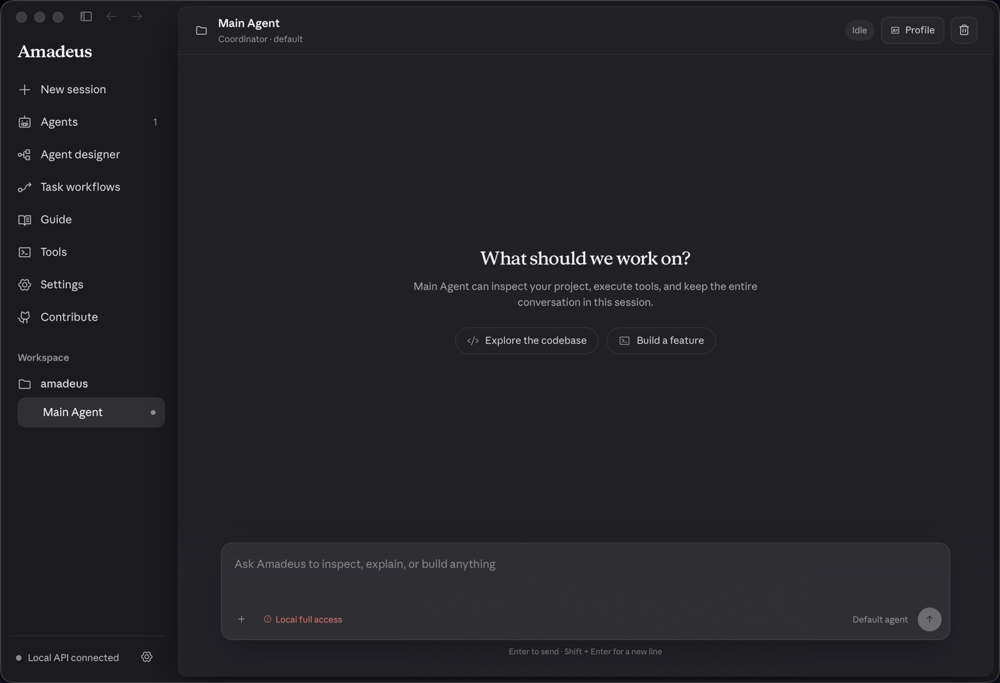
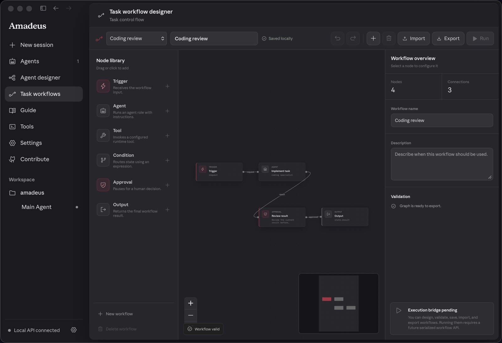
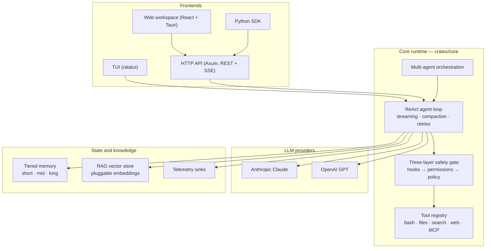
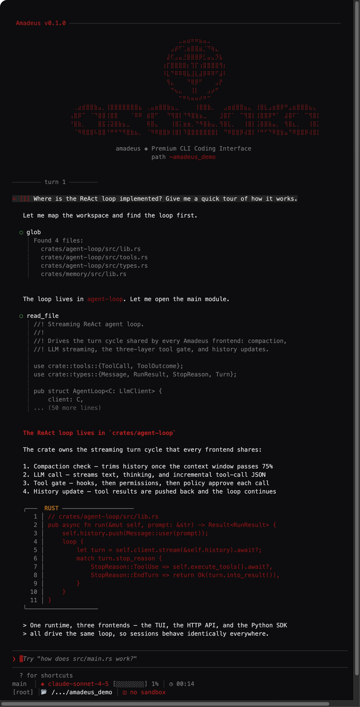

<div align="center">

# Amadeus

**A composable, multi-provider AI agent framework in Rust.**

Typed workflow runtime · ReAct agent loop · policy-based safety · tiered memory · RAG · native macOS app / web / TUI / REST frontends

[](https://github.com/xxraincandyxx/Amadeus/actions/workflows/ci.yml)
[](LICENSE)
[](https://www.rust-lang.org)
[](#)
[](CONTRIBUTING.md)

[Quickstart](#quickstart) · [Architecture](#architecture) · [Memory](#tiered-memory) · [Web & macOS](#web-workspace--macos-app) · [HTTP API](#http-api) · [Python SDK](#python-sdk) · [TUI](#tui) · [Docs](#documentation)

</div>

---

## Highlights

- **Native macOS desktop app (primary client)** — The Tauri 2 bundle hosts the React agent workspace in a native webview and supervises an embedded Amadeus server on `127.0.0.1:3000`, with live sessions, tools, approvals, checkpoints, and runtime connection settings.
- **Composable agent architectures** — Build typed asynchronous workflows, bind each workflow to an agent identity and resource set, and hold multiple differently configured agents in one registry. Models and tools are injected resources, not owners of the control flow.
- **Multi-provider LLM support** — Works with Anthropic Claude and OpenAI GPT behind a generic `LLMClient` trait; zero-cost polymorphism via monomorphization.
- **ReAct agent loop** — Streaming turn-based loop with tool execution, context compaction, and retryable error handling.
- **Extensible tool system** — Built-in tools for shell, filesystem, search, and web; register custom tools via the `Tool` trait; MCP server integration.
- **Policy-based safety** — A three-layer execution gate: hooks (input mutation/blocking), permission enforcer (hard blocks by mode), and policy (Auto / Ask / Strict approval).
- **Multi-agent orchestration** — Spawn agents with distinct profiles, route tasks by capability, and coordinate with a priority-ordered task queue.
- **Tiered memory** — Short-term context, a privacy-aware mid-term record database filled at compaction time, and long-term JSON/RAG memory (see [Tiered memory](#tiered-memory)).
- **RAG semantic search** — Ingest files, URLs, or raw text into a persistent vector store with pluggable embedding backends and int8 quantization; agents query it at runtime through the `rag` tool.
- **Context compaction** — Automatic context-window management with configurable thresholds, LLM-based summarization, and pluggable triggers.
- **HTTP API** — Axum REST + SSE server with 30+ endpoints for chat, sessions, multi-agent orchestration, memory, compaction, RAG, and more; the shared backend that both the desktop app and the TUI talk to.
- **Interactive TUI (secondary client)** — ratatui-based inline terminal UI with multi-panel layout, approval dialogs, tool monitoring, 12 themes, and conversation export.
- **Telemetry** — Structured event recording with pluggable sinks (JSONL file, in-memory) for runtime observability.
- **Session management** — Automatic session persistence, restore, checkpoints with code-state rewind, and conversation export to Markdown or JSON.

## Preview

<table>
  <tr>
    <td width="50%" align="center">
      
      <br>
      <strong>Native macOS app &amp; web workspace</strong><br>
      <sub>Multi-agent sessions, reasoning disclosure, live markdown</sub>
    </td>
    <td width="50%" align="center">
      
      <br>
      <strong>Task workflow designer</strong><br>
      <sub>Node-based canvas for task control flow</sub>
    </td>
  </tr>
</table>

## Quickstart

### Prerequisites

- Rust 1.70 or later
- An API key from Anthropic or OpenAI

### Setup

```bash
git clone https://github.com/xxraincandyxx/Amadeus.git
cd Amadeus

# Copy the settings template and configure your provider
mkdir -p .amadeus
cp .amadeus/settings.example.json .amadeus/settings.json
# Edit .amadeus/settings.json with your API key and provider

cargo build --release --features full
```

> [!TIP]
> Amadeus has no default features — use `--features full` for repository development and everyday use.

### Native macOS desktop app (primary)

Development mode — builds the server sidecar, then opens the native window:

```bash
cd apps/client
npm install
npm run desktop:dev
```

Build a distributable application bundle:

```bash
cd apps/client
npm run desktop:build
# -> apps/client/src-tauri/target/release/bundle/macos/Amadeus.app
```

The app starts and supervises its own server on port 3000; if a server already
owns that port it reuses it. See [docs/MACOS_APP.md](docs/MACOS_APP.md).

### HTTP API server

```bash
# Default port 3000
cargo run --features full -- --server

# Custom port
cargo run --features full -- --server 8080
```

### Interactive terminal UI (secondary)

```bash
cargo run --features full
```

## Architecture

Amadeus is a Cargo workspace built around a shared core runtime with pluggable frontends over it:


```mermaid
flowchart TB
    subgraph frontends [Frontends]
        direction LR
        TUI["TUI (ratatui)"]
        API["HTTP API (Axum, REST + SSE)"]
        WEB["Web workspace (React + Tauri)"]
        SDK["Python SDK"]
    end

    subgraph core [Core runtime — crates/core]
        LOOP["ReAct agent loop<br/>streaming · compaction · retries"]
        GATE["Three-layer safety gate<br/>hooks → permissions → policy"]
        TOOLS["Tool registry<br/>bash · files · search · web · MCP"]
        ORCH["Multi-agent orchestration"]
    end

    subgraph providers [LLM providers]
        CLAUDE["Anthropic Claude"]
        GPT["OpenAI GPT"]
    end

    subgraph state [State and knowledge]
        MEM["Tiered memory<br/>short · mid · long"]
        RAG["RAG vector store<br/>pluggable embeddings"]
        TEL["Telemetry sinks"]
    end

    TUI --> LOOP
    API --> LOOP
    WEB --> API
    SDK --> API
    ORCH --> LOOP
    LOOP --> CLAUDE
    LOOP --> GPT
    LOOP --> GATE --> TOOLS
    LOOP --> MEM
    LOOP --> RAG
    LOOP --> TEL
```

### Three-layer safety gate

| Layer | Purpose |
|-------|---------|
| **Hooks** | Extensible pre/post-tool interceptors that can modify input or block execution |
| **Permissions** | Mode-based hard blocks: `ReadOnly`, `WorkspaceWrite`, `DangerFullAccess`, `Prompt` |
| **Policy** | Runtime approval: `Auto` (none), `Ask` (dangerous only), `Strict` (all) |

## Tiered memory

Memory is organized in three tiers with different lifetimes:

| Tier | What it is | Where it lives | Lifetime |
|------|------------|----------------|----------|
| **Short-term** | The live context window: conversation history, session logs, compaction summaries | `Agent.history`, session JSON logs | One session / until compaction |
| **Mid-term** | A record database of what the conversation established: tasks, decisions, files touched, errors and resolutions, state snapshots | `crates/memory` → `.amadeus/mid_term_memory.json` | Across sessions, on disk |
| **Long-term** | Durable user/LLM-stored facts and semantic RAG | `JsonFileMemoryProvider` (`.amadeus/memory.json`), `VectorMemoryProvider` (`.amadeus/rag_index.json`) | Permanent |

The mid tier is filled by a gate: when compaction retires context, a `RuleBasedGate` runs over the retired messages, redacts sensitive data through the privacy detector, and upserts the surviving records. See [docs/MEMORY.md](docs/MEMORY.md) for the full contract and storage format.

## Built-in tools

| Tool | Description | Permission |
|------|-------------|------------|
| `bash` | Execute shell commands | Requires approval for dangerous commands |
| `read_file` | Read file contents | Auto-approved |
| `write_file` | Write or create files | Requires approval for sensitive paths |
| `edit_file` | Surgical file edits with diff rendering | Requires approval |
| `glob` | Pattern-based file matching | Auto-approved |
| `grep` | Search file contents with regex | Auto-approved |
| `web_fetch` | Fetch and render web page content | Requires approval |
| `todo` | Task tracking and planning | Auto-approved |
| `rag` | Ingest, search, and manage a vector knowledge base | Runtime |
| `memory` | Store and retrieve session-scoped notes | Runtime |

## Configuration

Structured settings live in `.amadeus/settings.json`, with global defaults in `~/.amadeus/settings.json` and workspace overrides in `.amadeus/settings.local.json`:

```json
{
  "provider": "anthropic",
  "api_key": "sk-ant-xxx",
  "base_url": "https://api.anthropic.com",
  "model": "claude-sonnet-4-5-20250929",
  "timeout_seconds": 120,
  "max_output_bytes": 50000,
  "session_log_dir": "./logs",
  "session_log_compress": true,
  "blocked_commands": ["rm -rf /", "sudo"],
  "tui": {
    "language": "en"
  }
}
```

The TUI supports English (`en`, the default) and Simplified Chinese (`zh-CN`). Set `tui.language` in any settings layer, or switch the current session with `/language en` and `/language zh-CN` (`/lang` is an alias). See [`.amadeus/README.md`](.amadeus/README.md) for the full configuration reference.

## Frontends

### Web workspace & macOS app (primary)

The React agent workspace lives in [`apps/client`](apps/client). It uses the stable `/v1/sessions/*` API for live history, SSE events, tools, approvals, cancellation, and checkpoints. See [`apps/client/README.md`](apps/client/README.md) for local and mock-server startup instructions, and the [preview](#preview) above for the workspace and task-workflow-designer captures.

The same interface is packaged as a native macOS client (`npm run desktop:dev` / `desktop:build`). See [`docs/MACOS_APP.md`](docs/MACOS_APP.md) for development and release builds and [`docs/WEB_DESIGN_SYSTEM.md`](docs/WEB_DESIGN_SYSTEM.md) for the product design contract.

### HTTP API

The HTTP API server exposes 30+ REST endpoints and SSE streaming. Start it with `--server [port]` (default 3000). Highlights:

| Method | Path | Description |
|--------|------|-------------|
| `GET` | `/health` | Health check |
| `POST` | `/chat` | Stateless single-turn chat |
| `POST` | `/execute` | Direct bash command execution |
| `GET` | `/v1/sessions/:id/events` | Stable SSE stream for a live session |
| `POST` | `/v1/sessions/:id/messages` | Start an asynchronous live-session turn |
| `POST` | `/v1/sessions/:id/approvals/:approval_id` | Resolve a session-scoped approval |
| `GET/PUT` | `/v1/sessions/:id/checkpoint` | Capture or restore a checkpoint |
| `POST` | `/tasks` | Multi-agent task dispatch |
| `POST` | `/rag/ingest` · `/rag/query` | Ingest and search the vector store |
| `GET/PUT/PATCH` | `/config` · `/tools/catalog` · `/skills` | Runtime configuration and catalogs |

The full endpoint reference lives in [docs/HTTP_API.md](docs/HTTP_API.md).

> [!WARNING]
> The API has no built-in authentication and full CORS enabled — it is designed for trusted internal use or deployment behind a reverse proxy.

### Python SDK

An async Python client for the HTTP API lives in [`python-sdk`](python-sdk):

```python
import asyncio
from amadeus_sdk import Agent

async def main():
    async with Agent("http://localhost:3000") as agent:
        turn = await agent.send("What is the current directory?")
        print(turn.text)

asyncio.run(main())
```

See [`python-sdk/README.md`](python-sdk/README.md) for installation and the full API surface.

### TUI (terminal client)

<p align="center">
  
  <br>
  <strong>Interactive TUI</strong> — streaming ReAct turn with tool groups and a status footer
</p>

The terminal UI is an inline-mode application that sits at the bottom of your terminal with scrollable conversation history above.

**Layout**

- **Messages pane** — Markdown-rendered conversation history with collapsible tool-execution groups and reasoning blocks
- **Input editor** — Multi-line input with slash-command completion, `@` file citation, and `!` shell mode
- **Footer** — Model name, context usage bar, session duration, Git branch, working directory, sandbox status
- **Sidebars** — File explorer, keyboard shortcut reference, and skill browser

**Key bindings**

| Key | Action |
|-----|--------|
| `Enter` | Submit prompt |
| `Ctrl+T` | Cycle themes (12 built-in) |
| `Shift+B` | Toggle file explorer |
| `Alt+S` | Toggle skill browser |
| `Ctrl+]` / `Ctrl+[` | Navigate sub-agent sessions |
| `Tab` / `Shift+Tab` | Cycle agent sessions |

**Slash commands** include `/compact`, `/context`, `/hooks`, `/language`, `/rewind`. Conversation export to Markdown or JSON includes full session metadata, a config snapshot, a context report, and statistics.

## Documentation

| Document | Covers |
|----------|--------|
| [docs/ARCHITECTURE.md](docs/ARCHITECTURE.md) | Architecture and ownership |
| [docs/AGENT_ARCHITECTURES.md](docs/AGENT_ARCHITECTURES.md) | Agent architecture runtime and manifests |
| [docs/EMBEDDING.md](docs/EMBEDDING.md) | Embedding Amadeus in Rust applications |
| [docs/HTTP_API.md](docs/HTTP_API.md) | Full HTTP contract |
| [docs/MEMORY.md](docs/MEMORY.md) | Tiered memory system and mid-term interfaces |
| [docs/RAG.md](docs/RAG.md) | Embedding backends and vector store |
| [docs/TOOLS.md](docs/TOOLS.md) | Tool system reference |
| [docs/COMPACTION.md](docs/COMPACTION.md) | Context compaction |
| [docs/MACOS_APP.md](docs/MACOS_APP.md) | Native macOS client |
| [docs/WEB_DESIGN_SYSTEM.md](docs/WEB_DESIGN_SYSTEM.md) | Web design contract |
| [DEVELOPMENT.md](DEVELOPMENT.md) | Development workflow |
| [.amadeus/README.md](.amadeus/README.md) | Configuration reference |
| [docs/TUI_TESTING.md](docs/TUI_TESTING.md) | TUI testing |

## Contributing

Contributions are welcome. Please:

1. Fork the repository
2. Create a feature branch
3. Make your changes
4. Run `cargo test --features full` and `cargo clippy --all-features -- -D warnings`
5. Submit a pull request

## License

MIT — see [LICENSE](LICENSE).
