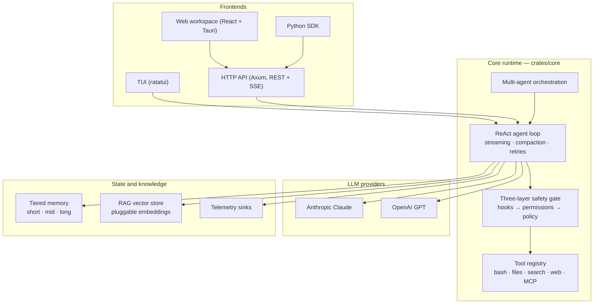

<div align="center">

[English](README.md) · 简体中文

# Amadeus

**可组合、多供应商的 Rust 智能体框架。**

类型化工作流 · ReAct 智能体循环 · 分层记忆 · RAG · 原生 macOS 应用、TUI 与 REST API

[](https://github.com/xxraincandyxx/Amadeus/actions/workflows/ci.yml)
[](LICENSE)
[](https://www.rust-lang.org)
[](#)
[](CONTRIBUTING.md)

[亮点](#亮点) · [预览](#预览) · [快速开始](#快速开始) · [架构](#架构) · [分层记忆](#分层记忆) · [接入方式](#接入方式) · [文档](#文档)

</div>

---

## 亮点

- **macOS 原生桌面应用（主力客户端）** — 原生 WebView 工作区，内嵌托管服务器：实时会话、工具、审批、检查点。
- **可组合的智能体架构** — 类型化异步工作流，一个注册表容纳多个可配置智能体；模型与工具皆为注入资源。
- **多供应商大模型** — 通过通用 `LLMClient` trait 同时支持 Anthropic Claude 与 OpenAI GPT。
- **ReAct 智能体循环** — 流式回合执行：工具调用、上下文压缩、可重试错误。
- **可扩展工具系统** — 内置 shell、文件、搜索、网页工具；经 `Tool` trait 注册自定义工具；支持 MCP。
- **三层安全防护** — 钩子、权限模式、Auto / Ask / Strict 审批策略。
- **多智能体协同** — 独立智能体档案、按能力路由、优先级任务队列。
- **分层记忆 + RAG** — 短/中/长期记忆，外加可插拔嵌入向量的持久化向量库（详见[分层记忆](#分层记忆)）。
- **HTTP API** — Axum REST + SSE，30+ 端点；所有客户端共享的后端。
- **交互式 TUI（次要客户端）** — 内联 ratatui 终端界面：审批、12 套主题、会话导出。
- **遥测** — 结构化事件记录，可插拔 sink。
- **会话管理** — 持久化、恢复、可回滚检查点、Markdown/JSON 导出。

## 预览

<table>
  <tr>
    <td width="50%" align="center">
      
      <br>
      <strong>原生 macOS 应用 &amp; Web 工作区</strong><br>
      <sub>多智能体会话、推理过程展开、实时 Markdown</sub>
    </td>
    <td width="50%" align="center">
      
      <br>
      <strong>任务工作流设计器</strong><br>
      <sub>任务控制流的节点式画布</sub>
    </td>
  </tr>
</table>

## 快速开始

### 准备工作

- Rust 1.70 或更高版本
- Anthropic 或 OpenAI 的 API key — 或者使用本地模型（见[运行本地模型](#运行本地模型无需-api-密钥)）

### 安装

```bash
git clone https://github.com/xxraincandyxx/Amadeus.git
cd Amadeus
mkdir -p .amadeus && cp .amadeus/settings.example.json .amadeus/settings.json
# 编辑 .amadeus/settings.json — 填入你的 API key 并选择供应商
cargo build --release --features full
```

> [!TIP]
> Amadeus 没有默认特性 — 仓库开发与日常使用请使用 `--features full`。

### macOS 原生桌面应用（主力）

从源码运行 — 先构建服务器 sidecar，再打开原生窗口：

```bash
cd apps/client
npm install
npm run desktop:dev
```

构建可分发的应用包：

```bash
cd apps/client
npm run desktop:build
# -> apps/client/src-tauri/target/release/bundle/macos/Amadeus.app
```

应用会在 3000 端口启动并托管自己的服务器；若该端口已被占用则直接复用。详见 [docs/MACOS_APP.md](docs/MACOS_APP.md)。

### HTTP API 服务器

```bash
# 默认端口 3000
cargo run --features full -- --server

# 自定义端口
cargo run --features full -- --server 8080
```

### 交互式终端 UI（次要）

```bash
cargo run --features full
```

### 运行本地模型（无需 API 密钥）

Amadeus 兼容任何 OpenAI 协议的服务端，因此可以直接对接跑在你自己机器上的模型。内置脚本会下载
`Qwen2.5-0.5B-Instruct`（GGUF，约 400 MB，缓存在 `.amadeus/models/`），并通过
[llama.cpp](https://github.com/ggml-org/llama.cpp) 的 OpenAI 兼容服务器在
`127.0.0.1:8123` 上提供服务。`.amadeus/models/` 中已有的任何 GGUF 会被直接使用；
只有目录里没有 GGUF 时才会触发下载：

```bash
brew install llama.cpp   # macOS；Linux 请自行构建 llama.cpp 并加入 PATH
scripts/setup_local_llm.sh
```

然后在 `.amadeus/settings.json` 中指向它：

```json
{
  "provider": "openai",
  "api_key": "local",
  "base_url": "http://127.0.0.1:8123/v1",
  "model": "qwen2.5-0.5b-instruct"
}
```

`base_url` 也可以只写主机（`http://127.0.0.1:8123`）或完整端点 —— 客户端会按需拼接
`/v1/chat/completions`。LM Studio、Ollama 与 vLLM 使用同一协议；按你的实际配置调整
`base_url`、端口与 `model` 即可。

## 架构

一套共享的核心运行时，所有前端皆是其上的薄适配层：



### 三层安全门

| 层 | 职责 |
|----|------|
| **钩子（Hooks）** | 可扩展的工具前后拦截器，可修改输入或阻止执行 |
| **权限（Permissions）** | 基于模式的硬性阻断：`ReadOnly`、`WorkspaceWrite`、`DangerFullAccess`、`Prompt` |
| **策略（Policy）** | 运行时审批：`Auto`（不审批）、`Ask`（仅危险操作）、`Strict`（全部） |

## 分层记忆

记忆按生命周期分为三层：

| 层级 | 内容 | 存储位置 | 生命周期 |
|------|------|----------|----------|
| **短期** | 活跃上下文窗口：对话历史、会话日志、压缩摘要 | `Agent.history`、会话 JSON 日志 | 单次会话 / 压缩前 |
| **中期** | 会话沉淀的记录库：任务、决策、触及的文件、错误与解决方案、状态快照 | `crates/memory` → `.amadeus/mid_term_memory.json` | 跨会话，落盘 |
| **长期** | 持久的用户/LLM 记忆事实与语义 RAG | `JsonFileMemoryProvider`（`.amadeus/memory.json`）、`VectorMemoryProvider`（`.amadeus/rag_index.json`） | 永久 |

当压缩淘汰上下文时，基于规则的门控会对敏感数据脱敏，并将幸存记录写入中期层。完整契约与存储格式见 [docs/MEMORY.md](docs/MEMORY.md)。

## 内置工具

| 工具 | 说明 | 权限 |
|------|------|------|
| `bash` | 执行 shell 命令 | 危险命令需审批 |
| `read_file` | 读取文件内容 | 自动批准 |
| `write_file` | 写入或创建文件 | 敏感路径需审批 |
| `edit_file` | 精确文件编辑，渲染 diff | 需审批 |
| `glob` | 按模式匹配文件 | 自动批准 |
| `grep` | 按正则搜索文件内容 | 自动批准 |
| `web_fetch` | 抓取并渲染网页内容 | 需审批 |
| `todo` | 任务追踪与规划 | 自动批准 |
| `rag` | 写入、检索与管理向量知识库 | 运行时 |
| `memory` | 存取会话级笔记 | 运行时 |

## 配置

结构化配置位于 `.amadeus/settings.json`，全局默认在 `~/.amadeus/settings.json`，工作区覆盖在 `.amadeus/settings.local.json`：

```json
{
  "provider": "anthropic",
  "api_key": "sk-ant-xxx",
  "base_url": "https://api.anthropic.com",
  "model": "claude-sonnet-4-5-20250929",
  "timeout_seconds": 120,
  "max_output_bytes": 50000,
  "session_log_dir": "./logs",
  "session_log_compress": true,
  "blocked_commands": ["rm -rf /", "sudo"],
  "tui": {
    "language": "en"
  }
}
```

TUI 支持英语（`en`，默认）与简体中文（`zh-CN`）。在任意配置层设置 `tui.language`，或在当前会话中用 `/language en`、`/language zh-CN`（`/lang` 为别名）切换。完整配置参考见 [`.amadeus/README.md`](.amadeus/README.md)。

## 接入方式

**一套运行时，四种驱动方式** — 原生桌面应用或浏览器工作区、终端、原生 HTTP 与 Python。

### Web 工作区与 macOS 应用（主力）

一个 React 智能体工作区，两种外壳：在浏览器中对接任意 Amadeus 服务器运行，或作为原生 macOS 应用运行并托管自己的内嵌服务器。实时历史、SSE 事件、工具、审批、取消与检查点均走稳定的 `/v1/sessions/*` API。

启动说明见 [`apps/client/README.md`](apps/client/README.md)，桌面构建见 [`docs/MACOS_APP.md`](docs/MACOS_APP.md)，设计契约见 [`docs/WEB_DESIGN_SYSTEM.md`](docs/WEB_DESIGN_SYSTEM.md)。

### HTTP API

用 `--server [port]`（默认 3000）启动 — 30+ REST 端点外加 SSE 流式传输。精选端点：

| 方法 | 路径 | 说明 |
|------|------|------|
| `GET` | `/health` | 健康检查 |
| `POST` | `/chat` | 无状态单轮对话 |
| `POST` | `/execute` | 直接执行 bash 命令 |
| `GET` | `/v1/sessions/:id/events` | 稳定的实时会话 SSE 流 |
| `POST` | `/v1/sessions/:id/messages` | 发起异步实时会话回合 |
| `POST` | `/v1/sessions/:id/approvals/:approval_id` | 解析会话级审批 |
| `GET/PUT` | `/v1/sessions/:id/checkpoint` | 捕获或恢复检查点 |
| `POST` | `/tasks` | 多智能体任务分发 |
| `POST` | `/rag/ingest` · `/rag/query` | 写入与检索向量库 |
| `GET/PUT/PATCH` | `/config` · `/tools/catalog` · `/skills` | 运行时配置与目录 |

完整端点参考见 [docs/HTTP_API.md](docs/HTTP_API.md)。

> [!WARNING]
> API 未内置鉴权且全开 CORS — 面向可信内网使用，或部署在反向代理之后。

### Python SDK

针对 HTTP API 的异步 Python 客户端位于 [`python-sdk`](python-sdk)：

```python
import asyncio
from amadeus_sdk import Agent

async def main():
    async with Agent("http://localhost:3000") as agent:
        turn = await agent.send("What is the current directory?")
        print(turn.text)

asyncio.run(main())
```

安装与完整 API 见 [`python-sdk/README.md`](python-sdk/README.md)。

### TUI（终端客户端）

<p align="center">
  
  <br>
  <strong>交互式 TUI</strong> — 流式 ReAct 回合：工具分组与状态栏页脚
</p>

终端 UI 是内联模式应用，位于终端底部，上方为可滚动的对话历史。

<details>
<summary><strong>布局、快捷键与命令</strong></summary>

**布局**

- **消息面板** — Markdown 渲染的对话历史，工具执行分组与推理块可折叠
- **输入编辑器** — 多行输入，支持斜杠命令补全、`@` 文件引用、`!` shell 模式
- **页脚** — 模型名、上下文用量条、会话时长、Git 分支、工作目录、沙箱状态
- **侧栏** — 文件浏览器、快捷键参考、技能浏览器

**快捷键**

| 按键 | 动作 |
|------|------|
| `Enter` | 提交输入 |
| `Ctrl+T` | 切换主题（12 套内置） |
| `Shift+B` | 切换文件浏览器 |
| `Alt+S` | 切换技能浏览器 |
| `Ctrl+]` / `Ctrl+[` | 导航子智能体会话 |
| `Tab` / `Shift+Tab` | 循环切换智能体会话 |

**斜杠命令**包含 `/compact`、`/context`、`/hooks`、`/language`、`/rewind`。会话可导出 Markdown 或 JSON，包含完整会话元数据、配置快照、上下文报告与统计信息。

</details>

## 文档

| 文档 | 内容 |
|------|------|
| [docs/ARCHITECTURE.md](docs/ARCHITECTURE.md) | 架构与所有权 |
| [docs/AGENT_ARCHITECTURES.md](docs/AGENT_ARCHITECTURES.md) | 智能体架构运行时与清单 |
| [docs/EMBEDDING.md](docs/EMBEDDING.md) | 在 Rust 应用中嵌入 Amadeus |
| [docs/HTTP_API.md](docs/HTTP_API.md) | 完整 HTTP 契约 |
| [docs/MEMORY.md](docs/MEMORY.md) | 分层记忆系统与中期接口 |
| [docs/RAG.md](docs/RAG.md) | 嵌入后端与向量库 |
| [docs/TOOLS.md](docs/TOOLS.md) | 工具系统参考 |
| [docs/COMPACTION.md](docs/COMPACTION.md) | 上下文压缩 |
| [docs/MACOS_APP.md](docs/MACOS_APP.md) | macOS 原生客户端 |
| [docs/WEB_DESIGN_SYSTEM.md](docs/WEB_DESIGN_SYSTEM.md) | Web 设计契约 |
| [DEVELOPMENT.md](DEVELOPMENT.md) | 开发工作流 |
| [.amadeus/README.md](.amadeus/README.md) | 配置参考 |
| [docs/TUI_TESTING.md](docs/TUI_TESTING.md) | TUI 测试 |

## 参与贡献

欢迎参与贡献 — 工作流与仓库规范见 [CONTRIBUTING.md](CONTRIBUTING.md)。PR 需通过 `./verify.sh`（与 CI 一致的验证门）。

## 许可证

MIT — 见 [LICENSE](LICENSE)。
